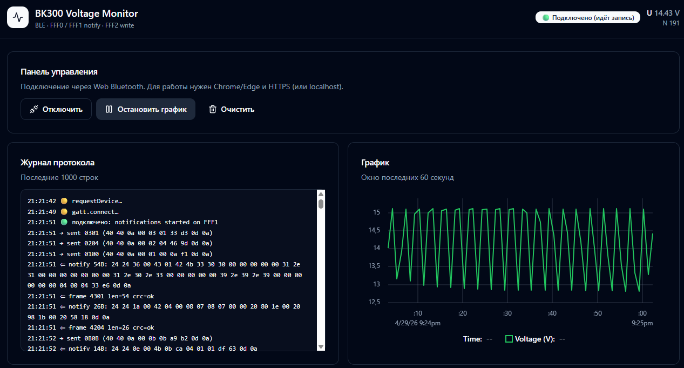

# BK300 decompile + Web Voltage Monitor

Этот репозиторий нужен для **реверс‑инжиниринга и документирования BLE‑протокола KONNWEI BK300**, а также для создания **простого веб‑монитора** (Web Bluetooth), который позволяет читать напряжение и наблюдать его в реальном времени. Это полезно, когда хочется понимать, **как именно** устройство общается по BLE, автоматизировать чтение данных или использовать BK300 **без/в дополнение** к мобильному приложению.

Репозиторий содержит:

- **`docs/spec.md`**: рабочая спецификация BLE‑протокола BK300 (включая подтверждённый путь чтения напряжения `0B0B → 4B0B`).
- **`web-monitor/`**: веб‑приложение (Web Bluetooth) для мониторинга напряжения в реальном времени, UI в стиле **shadcn** + график **uPlot**.

## Что такое BK300

**KONNWEI BK300** — это Bluetooth‑монитор автомобильного аккумулятора/электросистемы, совместимый с батареями **6V / 12V / 24V**. Он собирает данные о состоянии аккумулятора (в т.ч. напряжение), а также параметры пуска (cranking), работы системы зарядки и записи поездок; используется вместе с мобильным приложением **BKmonitor** (iOS/Android). Источник: [страница продукта KONNWEI BK300](https://konnwei.com/product/463.html).

## Скриншот



## Запуск веб‑приложения

```bash
cd web-monitor
npm install
npm run dev
```

Требования:

- Chrome / Edge с поддержкой Web Bluetooth
- HTTPS (или `http://localhost`)

